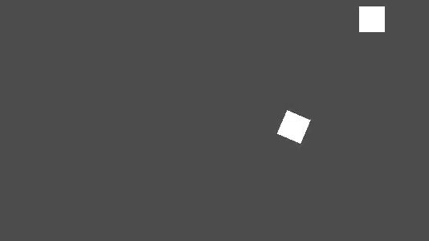

I am on my own learning Godot for fun and keep my mind sharp while I don't have a programming job or internship. I had an idea, which is instead of directly building a game with a clear vision of the end of it, why not build out cool mechanics, physics, and general components that can be used for any game. So far I have enjoyed building what I have so far and would love to share my code with anyone else actually building a game. With this building of generalized components, you no longer have the potential dissapointment of having a clear vision of a game, then failing to realize it. You can build your collection of components, then expiriment with many different kinds of games using them.

Right now all I have is an oscillator with adjustable speed, amplitude, and angle, but not center (x,y) yet. It would be cool to call a function like this multiple times and have multiple oscillators on the screen at once.

```gdscript
make_oscillator(
	speed = 5
	amplitude = 50
	angle = 45
	center = (30,60)
```



The player/spaceship has rotation and movement/thrust. Using lerp (linear interpolation) there smooth acceleration.

Random notes:
Planets orbit in ovals, which are represented with a triangle whose two sides move while one side is stationiary (down the middle of the oval). Gravity is any particle, node or spaceship's vector (x, y pos.) being modified by other node's vector/position depending on their distance between them and... surface area? Arbritrary density variable? 
